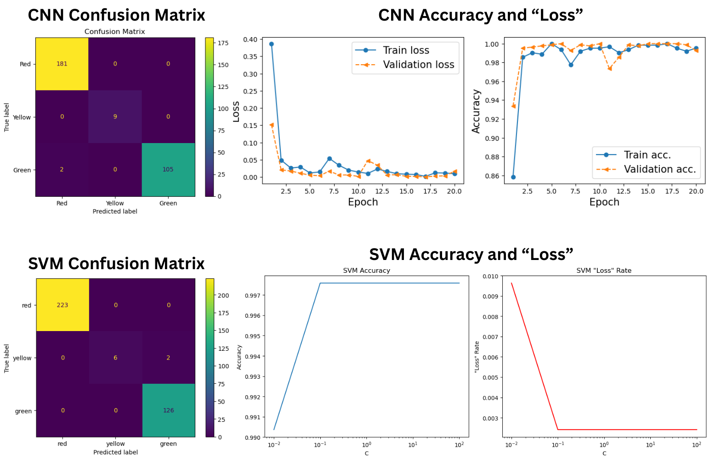

## Comparative Analysis of CNN & SVM for Image Classification

A computer vision project looking into two models to classify traffic light images as Red, Yellow, or Green. The goal was to achieve >90% accuracy while ensuring **zero misclassifications of Red lights**, a critical safety requirement for autonomous driving systems.

*Visual comparison of model performance and critical confusion matrices showing zero Red light misclassifications.*

**Full Code & Analysis:** 

[View Jupyter Notebook on GitHub](analysis/svm_cnn_analysis.ipynb)  

---

## Overview*

This project looks at a fundamental computer vision challenge for autonomous vehicles: accurately interpreting traffic signals. The analysis compares a deep learning approach (Convolutional Neural Network) with a traditional machine learning approach (Support Vector Machine) on a dataset of traffic light images, seeing which overall will perform better and reach critical safety metrics.

**Goal:** Reach > 90% accuracy and prove that no "RED" lights are misclassified.

## Process & Methodology
1. **Data Loading & Standardization:** Used OpenCV and Matplotlib to load images. Implemented a `standardize_input()` function to crop and resize all images to 32x32 pixels and normalize pixel values to 0-1.
2. **Exploratory Data Analysis (EDA):** Created lists for each color from the training and test directories, verified image dimensions were (32, 32, 3), and visualized samples to ensure correct labeling.
3. **Model 1 - CNN Development:** Built a Sequential CNN using TensorFlow/Keras with Conv2D, MaxPooling2D, Flatten, Dense, and Dropout layers. Compiled with Adam optimizer and SparseCategoricalCrossentropy loss.
4. **Model 2 - SVM Development:** Implemented a Support Vector Machine classifier with a linear kernel (`SVC(kernel='linear')`), flattening image arrays for compatibility.
5. **Model Evaluation:** Used `model.evaluate()` and `metrics.accuracy_score()` for accuracy. Analyzed performance with confusion matrices to verify zero Red misclassifications.

## Key Findings

-   **Both models exceeded the 90% accuracy goal:** CNN (99.33%) and SVM (99.44%)
-   **Zero Red light misclassifications:** Both models achieved 100% precision for Red lights, meeting the critical safety requirement
-   **CNN showed strong learning:** Achieved 100% validation accuracy by epoch 5 with minimal loss
-   **SVM demonstrated efficiency:** Achieved high accuracy with faster training time

## Conclusions & Recommendations

**Both models successfully met the primary objective** of >90% accuracy with zero Red light misclassifications.

**Recommendation: Implement the CNN model** for real-world autonomous driving applications:
-   Achieved 100% precision for both Red and Yellow lights
-   Deep learning architecture is better suited for complex visual pattern recognition
-   Perfect validation accuracy during training indicates strong learning capabilities

**Requirement Met:** Both models ensured **zero misclassifications of Red lights**, eliminating the most dangerous potential error for autonomous vehicle systems.

---

## Tools & Technologies

-   **Python** (OpenCV, NumPy, Matplotlib)
-   **TensorFlow/Keras** for CNN development
-   **Scikit-learn** for SVM and model evaluation
-   **Image Processing** (cropping, resizing, normalization)

## Data Source
- **Dataset:** Custom traffic light image dataset
  
